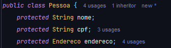
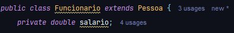

# Conceitos para revisão em caso de dúvida:
![naointendi](data:image/jpeg;base64,/9j/4AAQSkZJRgABAQAAAQABAAD/2wCEAAkGBxMTEhUTExMVFhUXFxcXFxgXFxcXFxgYFxcXFx0XGhgYHSggGBolHRcXITEhJSkrLi4uFx8zODMtNygtLisBCgoKDg0OGhAQFy0dHR0tLS0tLS0tLS0tLS0tKystLS0tLSstLS0tLS0tLS0tLS0tLS0tLS0tLS0tLS0tLS0tLf/AABEIAOEA4QMBIgACEQEDEQH/xAAbAAABBQEBAAAAAAAAAAAAAAAEAAIDBQYBB//EAEEQAAEDAgQCCAMHAwIEBwAAAAEAAhEDBAUSITFBUQYTIjJhcYGRobHwFCNCUsHR4RUzYlNyB4Ky8RYXJDRDY5L/xAAZAQADAQEBAAAAAAAAAAAAAAAAAQIDBAX/xAAiEQEBAAICAgICAwAAAAAAAAAAAQIRAxIhMRNBBDIiUWH/2gAMAwEAAhEDEQA/AM1l+9afH9CtIFmHf3Wef8LStOi8Hke9ic4KquO8rUpYdhnWPzOHZB91G9K0OwmyJALttPVXbRAgJrGgCAnLG3ZnJjyE4lDMdPxSNNTKIaFCwSFMxBJGJxcmtXJTJNSbK5UGsJlKvLo4cVLPbCZFVZACfRanXo0HmuW50TLfhM4IFGZkE8wUUQ4KdrUO0ou3EpQUixRO9ESWoKuzxTpRFXrNG5Crri8afxAIqraN3KCq9Uz8IJSaIGQ4iDPBF9UC6eAEKJhjWIkohzDrlRQ5oFLSqQUM0Hip6TCkBfWJLv2bx+CSA8jqEiqydNVp2KlsMN+97LSRr8lrbXD+J9l0cmUTjEVnaZjrsrmlTAEBcYyNhAUzZKwt2pwNXGlENaVHVpmJapCN6EszqRyPzU77gOERBVe2rlc/wgkp6Nat0PmnOkIWlcg6fXNSNqwgCadVMq1I1UOZDVzPFAWNo/VT03iZVdbv/lPDkFYuLjVia12iBZV7ICk62U9p0NBUV4zimMrQpw4EQmQRh0RNnU4IITso6dUtJSh2bW1epAVZc3McV11xO5UTnt4ot2JNA612ToJKjY+PwEk80S67YNGiT4KF2d2rzlbyG5QpHXfD6c8XE+wKNo1tUBAdW8GM+Lj+yKCKBThKfRQocuioR5pBYZ0kB1pSQNABDdgB6BHW1XMI8EBOYePH90y2r5Xt8dPfROhbhTMChqN3KnZskEza8cFxxa7wUTgoaghGy0GxDDzEtcdVQX5yte0klxA+BMrUuqaSeSz72gy534iT6KsTMtHnI07yPrRHdYSJhUd5fmm3QjKERRxikIDieHBVcS2tRWTXv8f4UDb2idqgHmpab6Z1D2n1U6NKHwpBV0UdRoI0I9Co2McDrMJGKZUXa9eBKFLlxxkEHiFWM8py9DLW+D9Jg8kYyqVh+sOctBOYfWi0OF3tTZ7dPZbZcP8ATLutnP4qKo/VTdWD4LhtR+ZY3CtJlAVUk7J7LAkS90Dlx+aKcAwbAoKvdSlqw97TlzGCGgfqhKzpIBMknQeCGq3GUEldsKLiDVeIJ7o4gIM+wdmNV/AugeTQiWOCr8EP3M83OPxRZcUX2E+ZQsqakniha9WXZG8O8eXh5pGqloxeZdQXWpII4Ogz7+R0UOIMLT8QuF8onEx2Wn/EJmOs7rNTY/no7zGisuq0karM4BW79M/7gr61rFh/xPwS0VEZVE/dEVXRBBkFRF0pFKBxAwwt5lZm+qFzgxvH5LQ4k6SfAKjtGEve4CSNAP8AIqoYOthud7aYkhurj8YWgrYWxzQ1wBHkiMMserZH4jq48yUeGc0XKjTKVei1MmRI8k0dEm/ncteGjkuyjvRpjn9F6gPYqH1RFHB7ho0qHhxMLVSuEo70aZwMvGj8DvPdOp3dQf3KMRxB/laANlV+KyWkDfQfFa8M7XbPkuoo6jzmLgAPmp21yIJcTyCZWYGwNyN/NB3FYHXYLt05drOliTkXSxRZSrdEd1CU8WqMMtIPgUdB2egMu5Ek6eOijq02O1afZedYpibzDnOOvAaAegXMD6SObUyzvwmR9aKbw7hzlkrb/Zu2M0HXsg7eZVjiVQU6TnuMQN/RU774VGyN9VW4ox9wwU+sIHLnCwvFG8z2uOi5D7YQZLSQ4DcKasw92cs6SSBl8dVkcLwi4pk9RVcAdCeBV3bdHHOE16jnk+Jj2lZ544y+1y1YOoU2gAVmD/mElRZaQ/8AmZ7p9Po9bt/B7p/9Ft/9Jnss94r8ofuv9dnukpv6Lb/6LfZdRuDyBJR+J9xvkJ9kFRbJ9f1U+Lv1aOTfnp+iQA4a7LVnnw9lp6BzBZJphwPr8FpcPqRHI/NFAqlWyy07HZNFTck6BcxWjLZG41Cr3Vpa1vMwpDl2exPPX3UfR6hOvjKixJ+mUak6BXVhQyMDeQVfQFAJSuLqgGuSCeAnNCYMXYTvNNKAQ2JHALNVqtTrhkgyG7kwQSZK1NPimU7ITJAMbLr/AB/1c3NfLJ3dsQ5xJVLdnUNC12OgTDjGp29FhMTL3VQGNd1YOrwDr5rrjnqWq2NFX3VvOoV5RtHin2u2ZMEaQ319UM62J2T2GWvK7i2DwQmGUy14cef7rUVMPbEOQn9LAMg+irsmYLHC7oyUa2truqqg3KFO2rqs8o3xbbCgOrECAjWtQWAa0h6q0DF5mXt1xFkXMinypFik0OQcklLk+oSQGesyMw81BevmoY2GgjTzTri1q0pLmOHjH6oNp0WnWjbj59lpMOIczL6jms4VY29fI1juQgpWBcsrEzTd4/BUeI18lVjRw191aXVQDLUBj/ssje3uaoXHifhGgRjiW1/hsVK08G/MrQlyzWAOyMl27iT8lb/bJ2U5ezWITwEAx53RTaiQSynscog4LjnoCao6UyFwFIlAPa6OXyVB0uurhlRnUSS4RAMDjJPorxVONUKtJzXgy0cxw25Lt/H/AFcvN7V1O2e8B9y4NPLNy4J9S+Y2WsiDvyKDv7vrNZI5gQY9Cgq7Z1kE8P5XRpiIu7gHiq9tRQEOnVPqbK5E2uVIKfSYEM2pwTeucNiiw5UdQQSE6jTJIATMpe5XeH2eXXilpVy00GC9lgniY8lctaqxjmsYArO2dLQuH8jHV234MtzR4auZE9Jczczq/FdT4SQGJssbqs7r3AcpkexVg3HGP/u0WO/yHZd6rMhy71i9KxytRcYXSqML7VxJHepu7wHhzVJ1zW02ZtdScvEydFBa3jqbg5jiCOI+SucNq0qrpcxmY8YHJY8uOvLXjt9KjEsXOTIBE8BOg5eaoqDKlR+jHR5H9V6YLRnBjfYJ3UgcPZYzlk+mlxUmG27WsEtcSrSlUH5T7IgsSDVlbtTjao5JzqwG5ShItHFIONu6f52+6kFVp/EPdCPsKZ/A32UNTB6buEeRIR4C1FUc09rhzVCcGaO6+oP+b90Ra4S7SKzzrx1VY49rpOV1NtjhlmCCSh8XptDoOxCPw6tlaGHQgb81X9IBqCNhGy9fDCY46eHy83bLcrMYlgDRL2OieE/BZvEbZzJn916LnpvZDm5hGsb7LK4nZskhoeBycCq6ow57LqsiHngVzOVcf01p2n2Sdg44ylpv8uPtRuco5Kva+EiNE+3w1reAJ8kaVOaUJhloDrCuaNuNJMA+6fbUdgiqwgRHqlorm40hzwOAV/RZoIWcu3dWxzmjXKVJ/wAO8cNzScH99pj0XLz49p4+nZwXXtow1TtYCFKQh36bLidST7OElF1rkkeB5eUylK4Ul6TnOKmtqxaZH1CHldDvr9UrNnLpucOu+saOY3RrVicHvjTeDOnELa0agc0EbHVcPLx9a3xy2RCbCkIShZLRZUg1SOC4UgaGpQunRRvqKpN0WuuajMN3PoqevcoduJZTuuzg49Xbk/IytwsjYXT4cI2TL1+hBOhB+vks5Txck6wQiru6DhAO40PBeht4OOP8tVNbVspjxQGJX7mGA/3Eqiubotnn+yAv8Yc5hkg8Ap26sePdXrbgnWSU4vBG6z+ENqntPJy8G8FYF6m5ab/DvwNuajQBH8qJj0PupRTUfI0n48FU6sbKZt3rqNFXuaoy9OZSpvDYd0gvQ2lUdwDT8dB8SsP0Nxt9vWJZrn0IR3TW/wBG0gd9Ssta1Mr2kcCPmq67i8LZXrw6SXMf2SfZOZ0jqHvsLPGFNZPzUmHmAnuoTuvKys36ejjPBv8AXR+c+xSXfsreQSU7itMYuFW2O4NUt3uBY4U8xDHEbidNVVFenXHLs0n6+vrVIFMJXUjPDlo+jmKR2HnTh4FZohPpvgzqpzx7RWN1XpSSqsDv+sbB7w+Ks6h0XnWWXTo2jrVYQ5r+KguayCfVWmPHtNy0OqXQQVzeFC1a6rr6qeC3w4ozyzS3WJDadfNVNe6UVUFRGgSuqTTDLyJs8Sc1w5K7p4j2SJ1gxx1/RZ+jbcVYtoGFfbw5c+HtluBL69dm04orBMMdW7TtGeW6dZ4Ua1RrRtx8tFocUeKTAxmm37rK579OqccgK7rA6N2HJKnSUFmyVYOMKbVSIJhPa8IWrU1TDcAcUpFC6j0LWqBoJOwQtfEAAVlsbxsvBY06cStMcajKqzFbw1arn8Nh5BCNOo80iusC3+nPL5eydGzNtSP+P6qyhV3Rkf8Apafl+pVkvFz/AGr1MfRsfWqSekoU0+E4pSxC3LXNEkQ9h1g7yPDxXlGO4U+2rOpvBEE5T+Zs6EJuD4o+3qCpTJBG4kwRyIW8vMVs8RohtRwp1oOXNplfGwcdwTC9i+Xl4y4X/Hmjk1pUlSnBIO4MKJwUug4FIpgKUoCww69NNwI4LdWlwKrA4Gf0Xm4ciqF0+Oy9zSOTiPl5LHk4pldrxy0193S5IByBGJPLQcx1TadzVOzCfQqJjo9p6wQ1WnKsqVJ53px6j5KelYnkAnslC6xUbbMkwBK1P2IcSnMt2t1AR3o0ojYOG4hRPaQtHmPn4fyoLBlLrJrNLY2B1aZ8QnMrS8RJglDq6Zcd3a+ipsbeXPgLUYjTjVo7JmI5BZO9MvV4xNp9toE3EL0MGphCVbxrQZOyyGK4q6q4nYTpr9eC0mG6zuWlvdYqJ3lVN1jLtmj3VeKijK1mLO5pK1053eOiHKkDVxypG9o3IuxpyR5j5oVGYUJqsHNzR8UZejx9x7HhrMtKmOTR8kQ0LlFsNaOQA+CVR0LxL7erD58B8V1C/afD4rqWjYGV0PTJXF6zhTTK5Ca1yekaJdCc8JiDIrrXRsuJJBrOjt8xzcjg0EagnluQrS2r03mGPYTymCfIHdYS3rFrg4GCEqr2uqZqry2TOYCT5jil1Fr0IsjcQuLNf1Z9BodTrtr03CQx41EcJGo34om36W0HN+8+7dxHeHuJU3ATJdl6je5CvvAdRBQ7q6jrVTIVVraKur3S7VkoOrTKqYltO/FHAHX9fmqetfuduB7Iw28hQPtVpiis1i1y8ggCJ3VJML0FtBvFoKgucKo1BEAH64hazJllPDC5ksy0N50TeNWODvrwVNc4dVZo5h+YV7jPQbMuEykWnkVzKUxp1WnRi3c+5phonUH0VUFf9CLvqrukeDzk9yAPjCjP9arCfyj10iPh8kypTlTJjwvFeoh6lJOynmkjZvJ3X4bvr6oq3vGvGhH6qlqMlRNp+MeIXsaeftpk6VSUb17e92hzH7KyoXYdt9aKdHsSHLhK4CuoPbkpJJJHt2U8NzaaeCjSTCKq0AjM6DykR/HqmUqPa7WUAAyUVWpZgDAMd7WDHOUFb1AahLXnY6FwbPrEFVGVEfanyTTeQ0EGJiPDVXFj0ny6VqWccwcpH6FUFOocjmvBYJmQYn02Kax0MApkOgwZMn2O3oixPZv7K/taw7FRrXflf2T8dCiKmHkcD+68xruaIB0d4SdfaUfZ43dUO5VzMHAw9p99R6Ql0HytlUoEcChajENZdOaToFemWH8ze03hwOqvm0qdUZqbg4cC0/McEtaV32o3MTDSVpUsoOqYaEIG1c1pG0jyU85u80EeUFE9WlkStOSK26wyi/dkz4AH3VRd9GGEdh0eB1C0hprnVlHY9MDdYHVZwLhzGv8AKFp0nNIOoIPiIK9HFBMrYWx/eaD9cwn3HVnrHpJdNj70u2Ha1CvbbpXU/E1p9/kh6nRlv4CW+BkhBV8IrM3bI5jVY3jwv02mdX3/AIp/+se5SWYjwd7JKfhw/pXeqWoE0tUzwmrqcyENhNNPWRoeYUxTUBLQv3t7wzDmN1Y292x+xVRJ4KNzQTPdPMI0NtGCkqWnfPb3u0OY39lYW961+x9EtK7CV1NlclI0rHQoK1u0OOhDXDRzYMHTQg+KfKkYWkZXag/DxTlTlNgaTXNY9oOfaYLSB5g6j0UL8pp/iYS7m3L+44I6rYtptBY5oOve0JMDsjgdNZUDoDQKoHMOAIePAmNZVysMpYbWa5tJhIzjXtEgg+Uaj1XHludrwS2cphzuXjwHmpKjS9jTTc0xIy5Q1/mfzBMuXsIaHNMxqQ3IfP8Ay802Z1So8POdsCCJBHdMnvbFD2xcw/cVSHcWmAI8Dsp67SCOqqA6DQNy+haT2ioSxr3mQGE7n4bcEDa+selFxSaBcND2EaEjte6vcNxq1uBpULH8Wu29CAsJUs6ogNOcbhoOafHLxRVLDDUDWtoPY/Z33ZDRPGTsErIqWvQvsRjMBmadnAgg+oUZo+CzWE4De0XDJXLWiQBmcW//AJ2WwpucWAPguG7gMs+iyum+NrrbaNBI2GkSSfP0TXW3aB3ifWOJRIfyjxn5qM1InT9UjRtojPmI21+vddp0iMwbE5h7eymqVI9QJKrr3G7emJdVYDMxIJMeARo9jK2klu+bWPAfup3sEO8fnoslddO7USAHnWZAVFff8QKhByAM7YI49kAb8iVUwtTctPScg8Pb+El5/wD+ZA/03fD9l1P46XdnnBMyp+VOAhNaNtNJzCpMyaap8EhpGWphCkc6UxMGZY2XDTB12PMJ6a8Sgjhevbo7tDnqjqN21w0KqpI+ioiBvq0+Cei2vS/6+ipmH6+iqJl69ne1HNHW16HDQpdT7L+zFN5DKolpETGrfEI+/wAArNZ908VGbw7cgbR6LOsqrZ9FsTzN6p51EZPHwU7sGWMrI3VIBsa03bZTwjnopGYfcuAb1bnDhmAgA/5bx4SvR3W7SZLQTzhIhP5Gd4mJo9Eahh2YMM7d6FcWvRxgzdac5duYDYO2mXZX4b4KKvcMZ33Nb5kfJLvR8cC2eFUKRllJrTzjX3KNAlVFx0iotMNl58Bp7qhxPpjUBhjabGz3nHMfYJearUbUBC3uJUaQmpUa3zK89vel87ve48m9lp+CzF9euquzRHIclU479js9JvenNuzRgc/fWABp5qgxDp/WcYptawc4BPxWNyOKlZZkq+mMLdoy96QV6nfqvPlAHwVe6o48/VFNswFOygOSe5B1qtbTcVO2y5lHNpjknAI7n1Cf04cykjMpSS7U+sHHu/XIJnFJJQox3e9/muO2SSTCN2/1yTUkkg4U1dSTIw7j65KAcPJJJVCvs07KG339Ukk/pP2vaSvMC/u0/wDePmkkssmkejqF26SSzVTbvueh+S86xf8A9wfT/pCSSeIQXGzv9v6rH3neKSS3wZZIQibdJJaVMFMU1Pf65pJLOrnpIz69guHgkkpUTtk9u6SSAlSSSUqf/9k=)

## Arrays:
São basicamente uma forma de armazenar várias variáveis do mesmo tipo em uma só coleção.
### multidimensionais
Arrays multidimensionais seguem o princípio de que cada [ ] do array faz referência à um outro array

Na imagem temos um array [3]  [3]
onde cada um dos 3 espaços do array se referenciam a um outro array com 3 espaços.

## Herança 
Herança é basicamente a capacidade de uma classe herdar os atributos da outra.
Para herdar as classes temos um comando simples chamado super.
Por exemplo: 
Aqui temos a classe pessoa, que tem seus atributos nome endereço e cpf. Mas no pacote domínio temos Funcionário,
que também é uma pessoa.
Então, dizemos que Funcionário vai ser uma classe filha de Pessoa, ou seja, uma subclasse de pessoa:

utilizamos (Nome da classe) extends (Nome da classe mãe) para herdar todos os atributos de uma certa classe
adicionando apenas as que não existiam anteriormente.
É importante destacar que só podemos usar a herança uma vez, ou seja, não se pode usar "extends Pessoa, (Outra classe)".

### protected 

