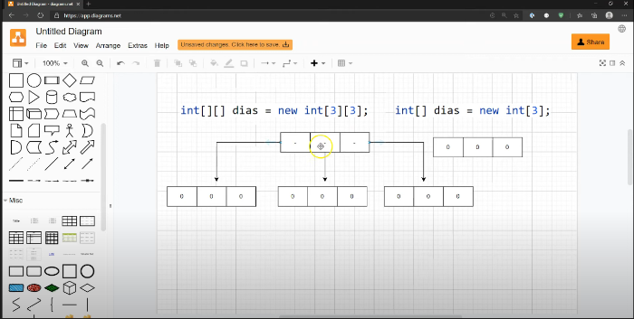

# Conceitos para revisão em caso de dúvida:

## Arrays:
São basicamente uma forma de armazenar várias variáveis do mesmo tipo em uma só coleção.
### multidimensionais
Arrays multidimensionais seguem o princípio de que cada [ ] do array faz referência à um outro array

Na imagem temos um array [3]  [3]
onde cada um dos 3 espaços do array se referenciam a um outro array com 3 espaços.

## Herança 
Herança é basicamente a capacidade de uma classe herdar os atributos da outra.
Para herdar as classes temos um comando simples chamado super.
Por exemplo: 

Aqui temos a classe pessoa, que tem seus atributos nome endereço e cpf. Mas no pacote domínio temos Funcionário,
que também é uma pessoa.
Então, dizemos que Funcionário vai ser uma classe filha de Pessoa, ou seja, uma subclasse de pessoa:

utilizamos (Nome da classe) extends (Nome da classe mãe) para herdar todos os atributos de uma certa classe
adicionando apenas as que não existiam anteriormente.
É importante destacar que só podemos usar a herança uma vez, ou seja, não se pode usar "extends Pessoa, (Outra classe)".

## Colections
Conceito:
Collection é uma interface base da linguagem Java que representa um grupo de objetos (também chamados de elementos).
Ela serve como estrutura para armazenar e manipular conjuntos de dados.

## Collections: Set
Conceito: Set é uma interface de Collection que representa um conjunto de elementos únicos, ou seja, não permite duplicatas.

Caracteristicas: 

- Não aceita objetos duplicados.
- Pode ser homogênea ou heterogênea.
- Pode ser ordenada.
- Não é indexado. Isso significa que seus elementos não podem ser acessados por posição (como em listas), pois não há uma ordem garantida nem índices associados a eles.

## Collections: Queue

### Comandos utilizados
O add() e o offer() são métodos usados para adicionar elementos em uma Queue. A diferença entre eles é que o add() lança uma exceção se a fila estiver cheia, enquanto o offer() apenas retorna false, sem lançar erro, sendo uma opção mais segura para filas com limite de tamanho.

Já o peek() e o element() são usados para consultar o primeiro elemento da fila sem remover o elemento. A diferença entre os dois é que o peek() retorna null se a fila estiver vazia, enquanto o element() lança uma exceção nesse caso. Isso significa que o peek() é mais seguro para evitar erros quando não temos certeza se a fila está vazia.

Essas diferenças são importantes para evitar comportamentos inesperados e erros em programas que trabalham com estruturas de dados como filas.

Os métodos poll() e remove() também são usados para acessar e remover o primeiro elemento de uma fila. A diferença entre eles é semelhante à dos métodos peek() e element(). O poll() remove o primeiro elemento da fila e, se a fila estiver vazia, retorna null sem lançar erro. Já o remove() faz a mesma coisa, mas lança uma exceção se não houver nenhum elemento para remover. Por isso, poll() é considerado mais seguro, especialmente quando não temos certeza se a fila está vazia. Esses métodos são úteis quando queremos consumir os elementos de uma fila, um por um.

# Pilares POO

# Encapsulamento

O encapsulamento é um dos pilares da programação orientada a objetos. Ele consiste na ideia de ocultar os detalhes internos de uma classe, expondo apenas o que for necessário para o funcionamento externo. Isso significa que os atributos (variáveis) de uma classe são geralmente privados e só podem ser acessados ou modificados por meio de métodos públicos chamados getters e setters.

Essa abordagem aumenta a segurança do código, pois impede que outras partes do programa alterem os dados diretamente de forma inadequada. Além disso, torna o sistema mais modular, facilitando a manutenção, a reutilização e a evolução do código ao longo do tempo.

O encapsulamento promove o princípio da "caixa preta", onde o usuário da classe sabe o que ela faz, mas não precisa saber como ela faz.

---

# Herança

A herança é um dos pilares da programação orientada a objetos que permite que uma classe reutilize atributos e métodos de outra classe. A classe que herda é chamada de **subclasse** (ou classe filha), enquanto a classe da qual ela herda é chamada de **superclasse** (ou classe pai).

Com a herança, é possível criar hierarquias entre classes, evitando a duplicação de código e facilitando a manutenção do sistema. A subclasse pode estender as funcionalidades da superclasse ou até mesmo sobrescrevê-las quando necessário.

Esse conceito é muito útil para representar relações do tipo "é um", como por exemplo: um **Cachorro** é um **Animal**, então a classe `Cachorro` pode herdar da classe `Animal`.

---

# Polimorfismo

O polimorfismo permite que objetos de diferentes classes respondam de maneira diferente à mesma mensagem ou chamada de método. Isso significa que o mesmo método pode ter comportamentos distintos dependendo do tipo do objeto que o invoca.

Existem dois tipos principais de polimorfismo:
- **Sobrecarga (polimorfismo estático):** o mesmo método com nomes iguais, mas com parâmetros diferentes.
- **Sobrescrita (polimorfismo dinâmico):** quando uma subclasse redefine um método herdado da superclasse com uma nova implementação.

O polimorfismo é importante para aumentar a flexibilidade e a reutilização de código, além de facilitar a manutenção e a extensão do sistema.

---

# Abstração

A abstração é o pilar da programação orientada a objetos que permite focar nos aspectos essenciais de um objeto, ocultando os detalhes desnecessários. Ela ajuda a representar ideias do mundo real no código de forma mais simples e clara.

Na prática, usamos a abstração para criar classes que representam conceitos genéricos, deixando os detalhes específicos para as subclasses. Por exemplo, uma classe `Veiculo` pode ter atributos e métodos comuns, e classes como `Carro` ou `Moto` herdam e implementam os detalhes específicos.

Com a abstração, conseguimos trabalhar com conceitos de forma mais organizada, facilitando a compreensão e o desenvolvimento de sistemas complexos.

---

# Modificador final

O modificador final é utilizado para quando um valor NUNCA será mudado, ou seja, queremos um valor constante.

---
# Classes Abstratas

## Regras de Métodos Abstratos

Classes abstratas podem conter métodos concretos e abstratos.

Métodos abstratos não possuem corpo e devem ser implementados pelas subclasses.

Uma classe que contém métodos abstratos deve ser declarada como abstrata.

Não é possível instanciar classes abstratas diretamente.

---

# Interfaces 
Interfaces são contratos que definem métodos que devem ser implementados pelas classes.

Todos os métodos em interfaces são implicitamente públicos e abstratos.

Interfaces não possuem construtores e não podem ser instanciadas.

## Interfaces : Implementando Múltiplas Interfaces

Uma classe pode implementar várias interfaces, permitindo múltiplas heranças de tipo.

Isso promove flexibilidade e desacoplamento no design do código.

## Interfaces: Atributos e Métodos Estáticos
Atributos em interfaces são implicitamente públicos, estáticos e finais.

Interfaces podem conter métodos estáticos e default (com implementação padrão).

---
## Polimorfismo : Funcionamento
Métodos chamados em objetos polimórficos são resolvidos em tempo de execução, permitindo comportamentos diferentes com a mesma interface.

##  Polimorfismo : Parâmetros Polimórficos
Métodos podem receber parâmetros do tipo da superclasse, permitindo que diferentes subclasses sejam passadas e tratadas de forma genérica.

## Polimorfismo : Cast e instanceof
Casting é usado para converter referências de superclasse para subclasse.

O operador instanceof verifica se um objeto é uma instância de uma classe específica antes de realizar o cast, evitando erros em tempo de execução.

## Polimorfismo : Programação Orientada a Interface
Programar voltado para interfaces promove baixo acoplamento e alta coesão.

Isso facilita a manutenção e testabilidade do código.

---

## Exceções : Errors
Errors representam problemas graves que geralmente não podem ser tratados pela aplicação, como StackOverflowError e OutOfMemoryError.

## Exceções : RuntimeException
RuntimeExceptions são exceções que ocorrem durante a execução e não precisam ser declaradas ou tratadas obrigatoriamente.

Exemplos incluem NullPointerException, ArrayIndexOutOfBoundsException, entre outras.

