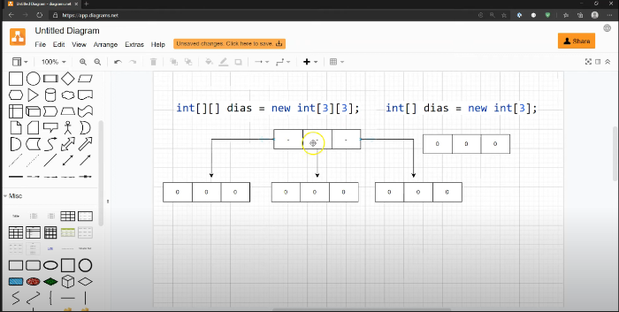

# Conceitos para revisão em caso de dúvida:

## Arrays:
São basicamente uma forma de armazenar várias variáveis do mesmo tipo em uma só coleção.
## multidimensionais
Arrays multidimensionais seguem o princípio de que cada [ ] do array faz referência à um outro array

Na imagem temos um array [3]  [3]
onde cada um dos 3 espaços do array se referenciam a um outro array com 3 espaços.

